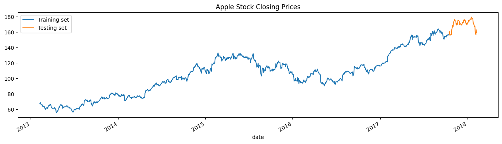
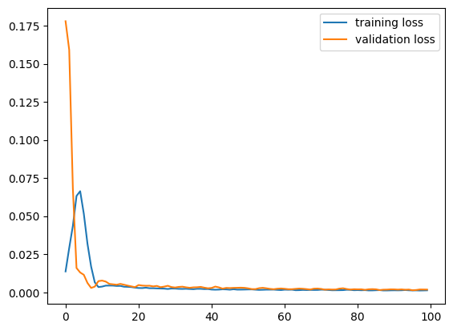
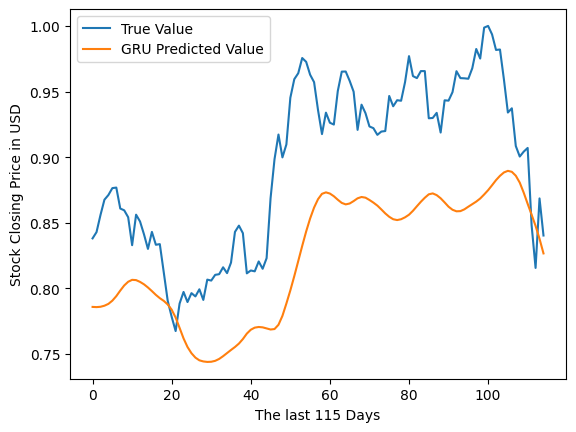
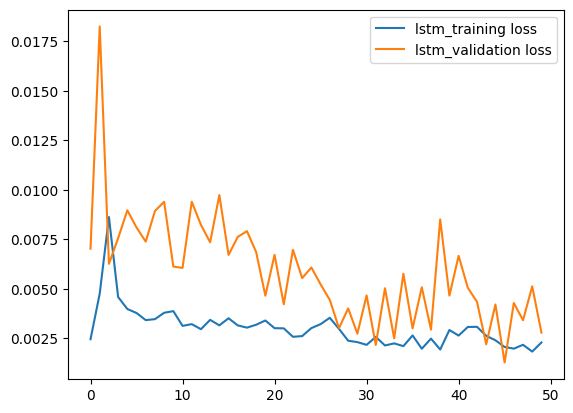
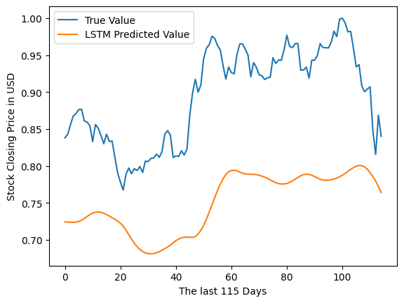

# Project Overview
Predicting Apple stock closing price trends from historical data with GRU and LSTM models from tensorflow and keras.  

## The Data  
Historical Apple Stock Data: https: //www.kaggle.com/datasets/camnugent/sandp500    

# Feature Engineering:     
The data set AAPL_data.csv contains the columns: [date, open, high, low, close, volume, and name] the name column was dropped from the dataframe and the date column was converted to datetime and set as the index.  


## Creating Moving Averages: 
In order to create features that will aid in the models predictions the 5 day and 50 day moving averages were calculated and stored in columns of the dataframe.  

```
df['mv_avg_short'] = df['close'].rolling(window=5).mean() 
df['mv_avg_long'] = df['close'].rolling(window=50).mean()  
```
## Feature Description: 
X (Independent Variables):

open: The price at which a stock first trades upon the opening of an exchange on a given trading day. 

high: The highest price at which a stock trades during a specific period. 

low: The lowest price of the stock during the same period. 

volume: The number of shares or contracts traded in a security or an entire market during a given period. 

mv_avg_short (Moving Average Short Term): This is a commonly used indicator in technical analysis that helps smooth out price action by filtering out the “noise” from random price fluctuations. It's a short-term moving average, possibly over days or weeks. 

mv_avg_long (Moving Average Long Term): Similar to the short-term moving average but calculated over a longer period. This could be over several weeks or months, providing insights into the longer-term trend of the stock price. 

Y (Dependent Variable): 

close: The final price at which a stock trades during a regular trading session. This is the target variable that the GRU model aims to predict. 

## Scaling and Cleaning:  
In order to use volume as a feature in our models the values for all of our features must be scaled between 0 and 1 due to how large the values for volume are. Aditionally the first 50 days of data is removed due to the fact that we do not have 50 moving averages for those days. 

```
scaler = MinMaxScaler(feature_range=(0,1))
df_scaled = pd.DataFrame(scaler.fit_transform(df[["high","low","open","close","volume",
                                                 "mv_avg_short","mv_avg_long"]].values)) 
 
df_scaled = df_scaled.iloc[50:,:]
```
# Data Preprocessing  

## Formatting Data for GRU Model and LSTM Model: 
The data is restructured into sequences to fit the GRU model's requirements, which is designed to process data in sequences or time steps. Here, each sequence (or sample) consists of 60 consecutive time steps, with each time step comprising the selected features (open, high, low, volume, mv_avg_short, and mv_avg_long). The sequences in X are used to predict the value of Y, the closing price, at the subsequent time step. By training the GRU model on this structured data, it learns to understand the temporal dynamics and the relationship between the various features over time to make accurate predictions about the closing price. 

```
# Need the data to be in the form [sample, time steps, features (dimension of each element)]
samples = 60 # Number of samples (in past)
steps = 1 # Number of steps (in future)
X = [] # X array
Y = [] # Y array
for i in range(df_scaled.shape[0] - samples): 
    X.append(df_scaled.iloc[i:i+samples,[0,1,2,4,5,6]].values) # Independent Samples
    Y.append(df_scaled.iloc[i+samples, [3]].values) # Dependent Samples
print('Training Data: Length is ',len(X[0:1][0]),': ', X[0:1])
print('Testing Data: Length is ', len(Y[0:1]),': ', Y[0:1])
```
Dimensions of X (1149, 60, 6) Dimensions of Y (1149, 1)  

The data is then split into training and testting sets with 90% of the data making up the training set (1034 days) and 10% of the data representing the test set (115 days): 
```
threshold = round(0.9 * X.shape[0])
trainX, trainY = X[:threshold], Y[:threshold]
testX, testY =  X[threshold:], Y[threshold:] 
print(threshold)
print('Training Length',trainX.shape, trainY.shape,'Testing Length:',testX.shape, testY.shape)
```
Training Length (1034, 60, 6) (1034, 1) Testing Length: (115, 60, 6) (115, 1)    

# GRU Model   
```
# Stack the Layers Lineary for time-series data
model = models.Sequential()

    # First GRU layer with Dropout regularisation
model.add(layers.GRU(units=50, return_sequences=True, input_shape=(X.shape[1],X.shape[2]), activation='tanh'))
model.add(layers.Dropout(0.2))  


    # Second GRU layer
model.add(layers.GRU(units=50, return_sequences=True, input_shape= (X.shape[1],X.shape[2]), activation='tanh'))
model.add(layers.Dropout(0.2))
    
    # Third GRU layer
model.add(layers.GRU(units=50, return_sequences=True, input_shape = (X.shape[1],X.shape[2]), activation='tanh'))
model.add(layers.Dropout(0.2)) 

    # Fourth GRU layer
model.add(layers.GRU(units=50, activation='tanh'))
model.add(layers.Dropout(0.2)) 

    # The output layer
model.add(layers.Dense(units=1))   


model.compile(optimizer=tf.keras.optimizers.legacy.SGD(learning_rate=0.01, momentum=0.9, nesterov=False),loss='mean_squared_error')

history = model.fit(trainX,
                    trainY,
                    shuffle = False, # Since this is time series data
                    epochs=100,
                    batch_size=32, 
                    validation_split=0.2,
                    verbose=1)
```
## Model Architecture (GRU):

The model is initialized using a sequential stack, allowing us to linearly stack layers. The first GRU layer has 50 units and uses 'tanh' activation. It's set to return sequences, meaning the output for each timestep is returned, allowing the next GRU layer to receive sequences of data for temporal processing. A dropout layer follows the first GRU layer, with a dropout rate of 20%, to reduce overfitting by randomly omitting a portion of the features during training.
Subsequent GRU layers follow a similar structure, with each having 50 units and 'tanh' activation. The final GRU layer does not return sequences since it feeds into the dense output layer. The output layer is a dense layer with a single unit to predict the closing price. 

## Compilation and Training (GRU):

The model uses the SGD (Stochastic Gradient Descent) optimizer with a learning rate of 0.01 and a momentum of 0.9. We do not use Nesterov accelerated gradient in this case. The loss function is mean squared error, suitable for regression tasks like predicting stock prices. The model is trained with the historical stock price data, where we do not shuffle the batches (important for time-series data to maintain the temporal sequence of observations).
We train the model for 100 epochs with a batch size of 32 and use a validation split of 20% to monitor the model's performance on unseen data during training. 

## Model Training Output (GRU):

During training, the model's performance is monitored using the loss and mean squared error metrics on both training and validation sets. These metrics help in evaluating how well the model is learning and generalizing over time.
This GRU model is specifically tailored to leverage the sequential nature of time-series data in stock price prediction, capturing the temporal dependencies and trends present in the historical data to forecast future stock prices effectively. 

# LSTM Model 
```
regressor = models.Sequential()

# add first layer with dropout

regressor.add(layers.LSTM(units=50, return_sequences=True, input_shape=(X.shape[1],X.shape[2])))
regressor.add(layers.Dropout(0.2))

# add second layer

regressor.add(layers.LSTM(units=50, return_sequences=True))
regressor.add(layers.Dropout(0.2))

# add third layer

regressor.add(layers.LSTM(units=50, return_sequences=True))
regressor.add(layers.Dropout(0.2))

# add fourth layer

regressor.add(layers.LSTM(units=50))
regressor.add(layers.Dropout(0.2))

# the output layer

regressor.add(layers.Dense(units=1))    


regressor.compile(optimizer = tf.keras.optimizers.Adam(), loss='mean_squared_error')

lstm_trained = regressor.fit(trainX,
                              trainY,
                              shuffle = False, # Since this is time series data
                              epochs=50,
                              batch_size=32,
                              validation_split=0.2,
                              verbose=1)
```
## Model Architecture (LSTM):

The model begins with a sequential layout, facilitating the linear stacking of LSTM and dropout layers. The first LSTM layer has 50 units and is set to return sequences, allowing the subsequent LSTM layer to receive full sequences of data. This is critical for maintaining temporal information throughout the model. Following the first LSTM layer, a dropout layer with a rate of 20% is applied to minimize overfitting by neglecting a fraction of the neurons' connections randomly. This pattern continues for three more LSTM layers, each followed by a dropout layer with the same dropout rate to consistently mitigate overfitting across the network. After the LSTM layers, a dense layer with one unit serves as the output layer, providing the predicted closing price. 

## Compilation and Training (LSTM):

The model uses the Adam optimizer, a popular choice for deep learning models due to its adaptive learning rate capabilities. The loss function is mean squared error, aligning with the regression nature of our prediction task. Training involves feeding the model with batches of historical data without shuffling, preserving the chronological order essential for time-series analysis. The model is trained over 50 epochs with a batch size of 32. During training, 20% of the data is used for validation to monitor the model's performance on unseen data. 

## Model Training Output (LSTM):

The training process logs the loss values, offering insights into how well the model is learning to predict the stock prices. The validation loss provides a gauge for the model's generalization ability.  

# Evaluating Results 
## Apple Stock Closing Prices: 
This chart depicts the historical closing prices of Apple stock with a clear distinction between the training set and the testing set. The training set appears to have a stable rising trend, while the testing set shows increased volatility and a steeper upward trend. If the models were trained on the period with lower volatility, they might not have learned to predict the sharper increases accurately.  




## Training and Validation Loss (GRU Model): 
The loss curves for the GRU model show that the training loss decreases rapidly and then plateaus, which is typical and indicates good convergence. The validation loss is very close to the training loss, which usually suggests that the model is not overfitting. However, if the validation loss does not include the periods of higher volatility (as seen in the stock prices chart), the model might not generalize well to the more volatile testing set. 



## GRU Predicted vs. True Value:  
In the visualization comparing the true stock closing prices with the GRU predicted values over the last 120 days, the GRU model seems to be catching the trend but not the magnitude of changes. This underestimation could be due to the model not being complex enough to capture the full extent of the variability in the stock prices or due to the lack of relevant features that drive the prices higher. 



## Training and Validation Loss (LSTM Model):  
The LSTM model's loss curves show a different pattern. The training and validation loss have more variance, and the validation loss is consistently higher than the training loss. This could indicate that the LSTM model is not learning as effectively as the GRU model or that it may be overfitting to the training data and thus not generalizing well to the validation set. 



## LSTM Predicted vs. True Value:  
The LSTM model's predictions also show a trend similar to the actual values but significantly underpredicts them. This underperformance could be due to overfitting, as suggested by the loss curves, where the model learns the noise in the training data rather than the underlying trend.

 

## Conclusions from Visualizations:

Both models have difficulty capturing the magnitude of the stock price movements, particularly during more volatile periods. This could be due to a lack of training data that includes similar levels of volatility or due to the inherent noise and unpredictability in stock price movements, which are difficult to model. The GRU model seems to perform slightly better than the LSTM, which is indicated by closer training and validation loss values. However, both models fail to predict the more substantial rises in stock prices. Improvements might include re-training the models on a dataset that includes more recent volatile periods, revisiting the feature set to include more predictive variables, or experimenting with more complex architectures or hyperparameters to better capture the variability in the data.

